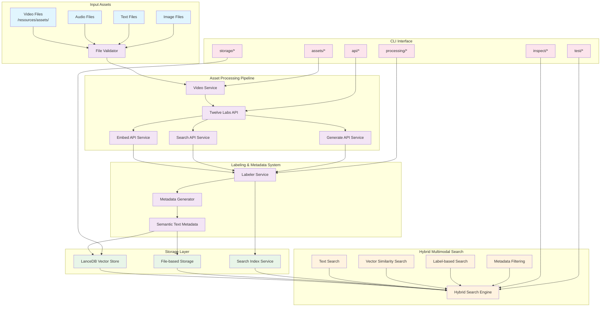
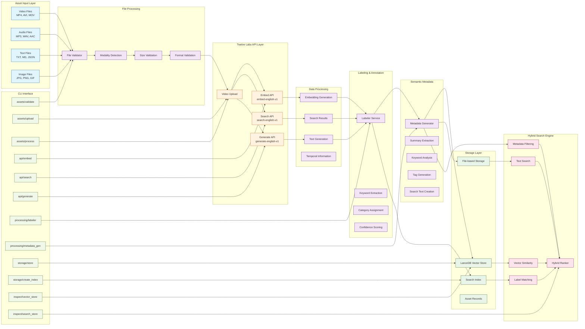
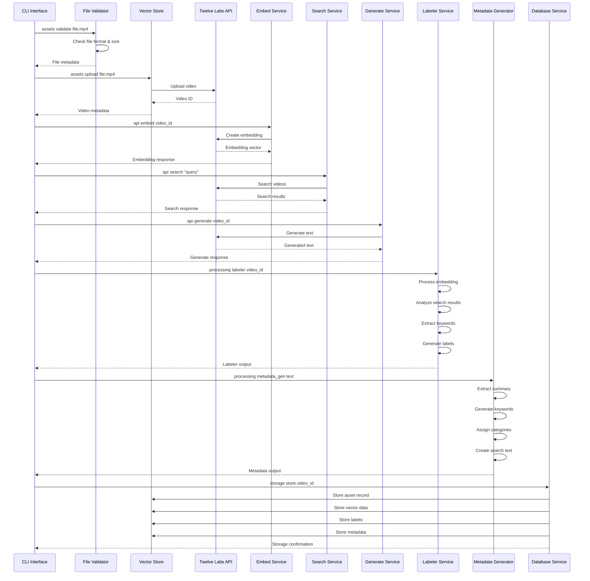
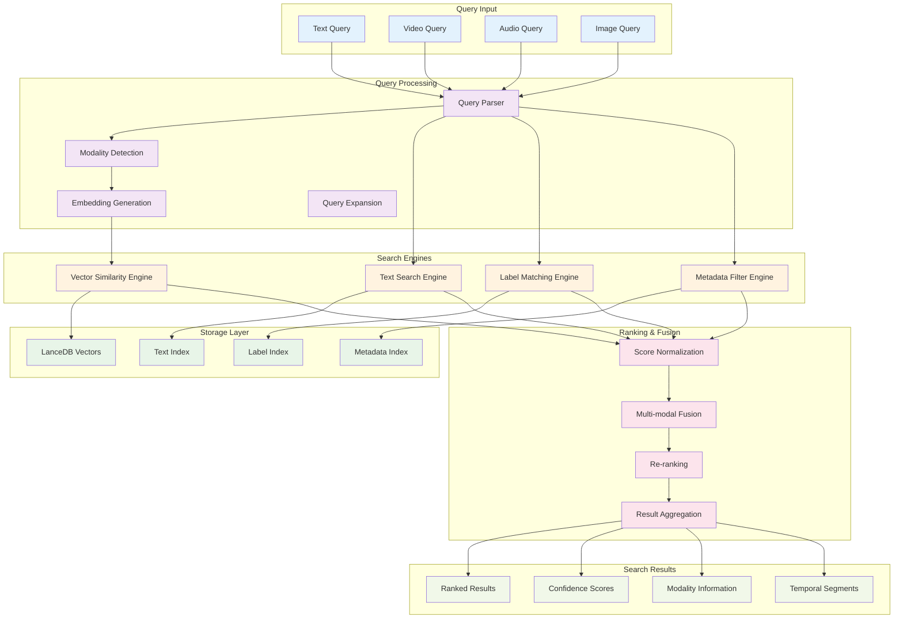

# Twelve Labs Asset Processing & Search System Design

## System Architecture Overview

## Detailed Component Architecture

## Data Flow for Asset Labeling

## Hybrid Multimodal Search Architecture

## CLI Command Structure

```mermaid
graph TD
    subgraph "Main CLI Commands"
        M1[twelve-labs-sa]
        M2[--version]
        M3[--help]
    end

    subgraph "Asset Management"
        A1[assets list]
        A2[assets validate file]
        A3[assets upload file]
        A4[assets process file]
    end

    subgraph "API Operations"
        API1[api embed video_id]
        API2[api search-text query]
        API3[api search-video video_id]
        API4[api generate video_id]
    end

    subgraph "Processing Pipeline"
        P1[processing labeler video_id]
        P2[processing metadata_gen text]
    end

    subgraph "Storage Operations"
        S1[storage store video_id]
        S2[storage create_index asset_id]
    end

    subgraph "Inspection & Debugging"
        I1[inspect vector_store]
        I2[inspect export_store]
        I3[inspect import_store]
        I4[inspect clear_store]
        I5[inspect search_store keyword]
        I6[inspect list_by_modality]
        I7[inspect embeddings]
    end

    subgraph "Output & Export"
        O1[output export_data file]
        O2[output search_export query]
    end

    subgraph "Testing & Validation"
        T1[test search query]
        T2[test metadata text]
        T3[test eval asset_id]
        T4[test all]
        T5[test vector_store_demo]
    end

    subgraph "LanceDB Operations"
        L1[lancedb init]
        L2[lancedb similarity_search]
        L3[lancedb text_search]
        L4[lancedb stats]
    end

    subgraph "Batch Processing"
        B1[batch process_batch path]
    end

    subgraph "Specification Compliance"
        SP1[spec compliance_demo]
        SP2[spec process_asset]
    end

    %% Connections
    M1 --> A1
    M1 --> API1
    M1 --> P1
    M1 --> S1
    M1 --> I1
    M1 --> O1
    M1 --> T1
    M1 --> L1
    M1 --> B1
    M1 --> SP1

    %% Styling
    classDef mainStyle fill:#e1f5fe
    classDef assetStyle fill:#f3e5f5
    classDef apiStyle fill:#fff3e0
    classDef processStyle fill:#e8f5e8
    classDef storageStyle fill:#fce4ec
    classDef inspectStyle fill:#f1f8e9
    classDef outputStyle fill:#fff8e1
    classDef testStyle fill:#e0f2f1
    classDef lancedbStyle fill:#fafafa
    classDef batchStyle fill:#f5f5f5
    classDef specStyle fill:#fafafa

    class M1,M2,M3 mainStyle
    class A1,A2,A3,A4 assetStyle
    class API1,API2,API3,API4 apiStyle
    class P1,P2 processStyle
    class S1,S2 storageStyle
    class I1,I2,I3,I4,I5,I6,I7 inspectStyle
    class O1,O2 outputStyle
    class T1,T2,T3,T4,T5 testStyle
    class L1,L2,L3,L4 lancedbStyle
    class B1 batchStyle
    class SP1,SP2 specStyle
```

## System Benefits & Features

### Asset Labeling System
- **Multi-modal Support**: Handles video, audio, text, and image files
- **Automated Labeling**: Uses AI-generated content to create semantic labels
- **Confidence Scoring**: Provides confidence levels for generated labels
- **Category Assignment**: Automatically categorizes assets by content type

### Semantic Metadata Generation
- **Rich Descriptions**: Generates detailed, searchable text descriptions
- **Keyword Extraction**: Identifies relevant keywords and phrases
- **Tag Generation**: Creates semantic tags for improved discoverability
- **Search Text Creation**: Optimizes text for search engine compatibility

### Hybrid Multimodal Search
- **Multi-modal Queries**: Supports text, video, audio, and image queries
- **Vector Similarity**: High-performance similarity search using embeddings
- **Label Matching**: Semantic search using generated labels
- **Metadata Filtering**: Filter results by categories, tags, and metadata
- **Fusion Ranking**: Combines multiple search strategies for optimal results

### Storage & Scalability
- **LanceDB Integration**: High-performance vector database
- **File-based Storage**: Fallback storage option
- **Search Indexing**: Optimized search index creation
- **Export/Import**: Data portability and backup capabilities

### CLI Interface Benefits
- **Comprehensive Coverage**: All system operations accessible via CLI
- **Batch Processing**: Efficient processing of multiple assets
- **Testing Framework**: Built-in testing and validation tools
- **Inspection Tools**: Debugging and monitoring capabilities
- **Flexible Output**: Multiple output formats (JSON, CSV, YAML) 